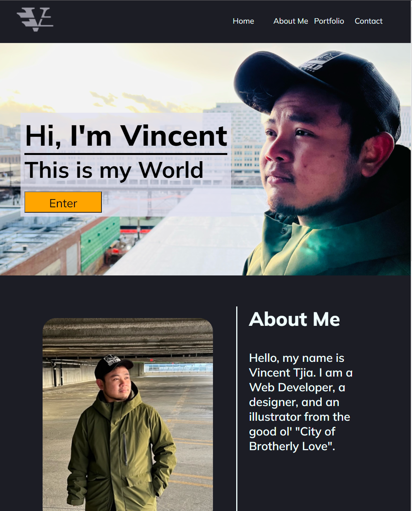
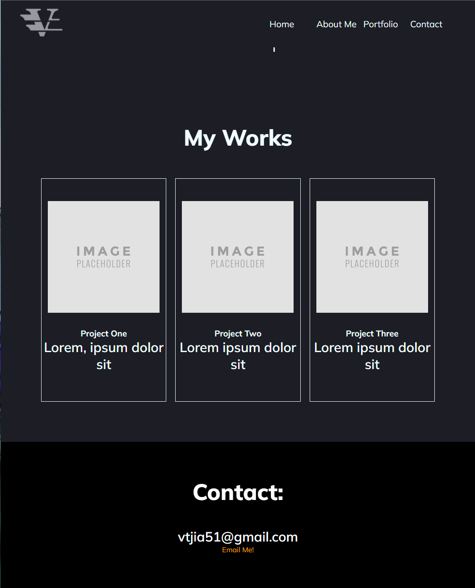
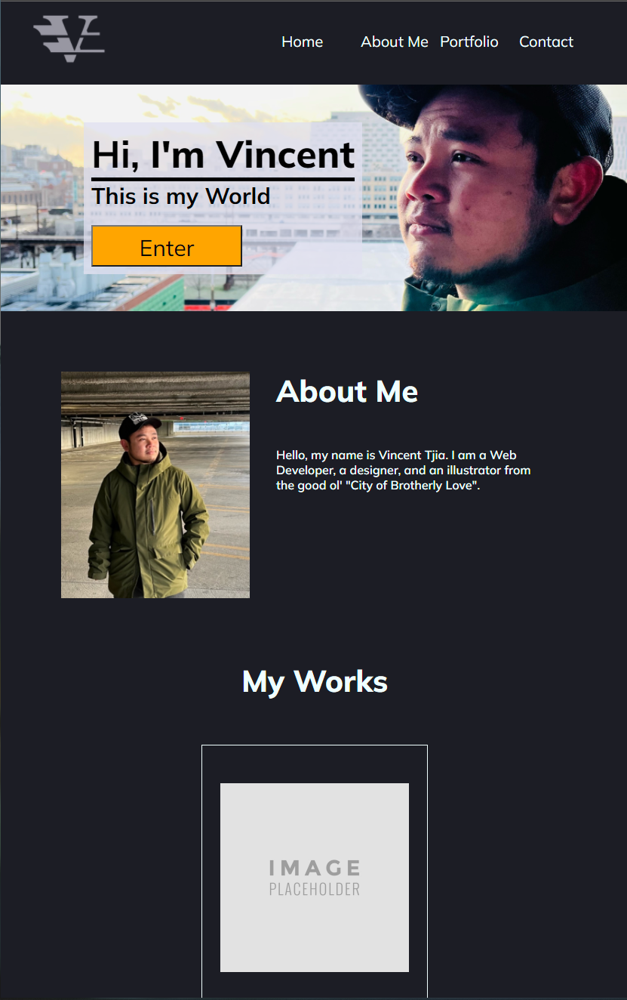
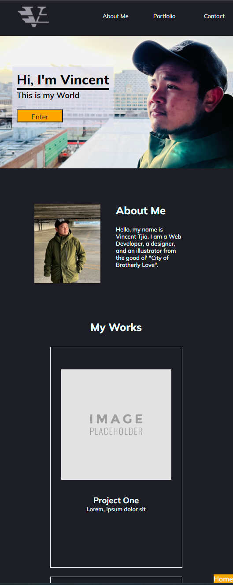

# Personal Portfolio Website

I thought about building my portfolio website to showcase my skills and what types of services I offer. This website will enable employers to see the types of projects I have accomplished in my webdev carrer. This website will be undergoing many stages as my knowledge in Web development grow.  

Acceptance Criteria
Here are the critical requirements necessary to develop a portfolio that satisfies a typical hiring manager’s needs:

GIVEN I need to sample a potential employee's previous work:
* WHEN I load their portfolio
THEN I am presented with the developer's name, a recent photo or avatar, and links to sections about them, their work, and how to contact them
* WHEN I click one of the links in the navigation
THEN the UI scrolls to the corresponding section
* WHEN I click on the link to the section about their work
THEN the UI scrolls to a section with titled images of the developer's applications
* WHEN I am presented with the developer's first application
THEN that application's image should be larger in size than the others
* WHEN I click on the images of the applications
THEN I am taken to that deployed application
* WHEN I resize the page or view the site on various screens and devices
THEN I am presented with a responsive layout that adapts to my viewport

## Screenshots

### Desktop view (width > 980px):

 ### Width < max-width: 980px:
 

 ### Smaller devices (width <= 576px):
 
 
 ## URL
 https://vincent-tj.netlify.app/
